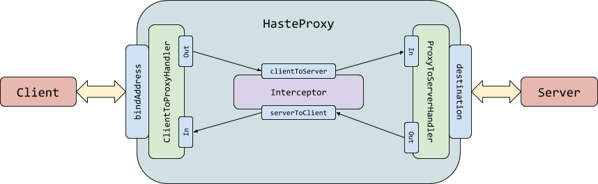

# HasteProxy
An experimental proxy server that runs on the JVM

## Protocol Support
- TCP: Fully working, there shouldn't be any issues

## How does it work?

This readme sucks, but this awesome google drawing diagram doesn't!

